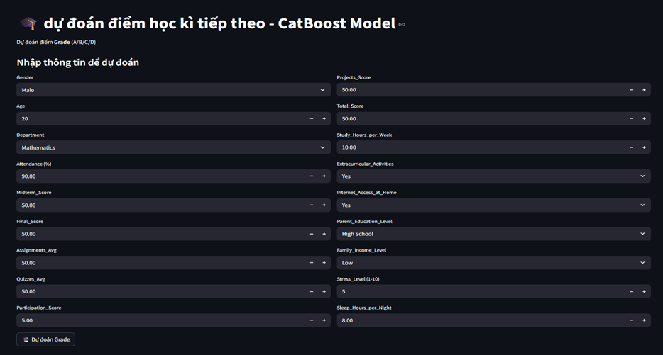
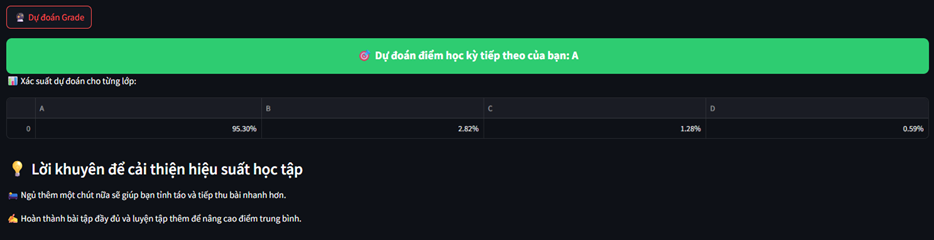

# 🎓 Student Performance & Behavior Dataset – Data Cleaning, Analysis & Machine Learning  

# 🎓 XÂY DỰNG MÔ HÌNH DỰ ĐOÁN KẾT QUẢ HỌC TẬP CỦA SINH VIÊN  

---

## 📌 Mục tiêu dự án  
Mục tiêu của dự án này là phát triển mô hình dự đoán **kết quả học tập của sinh viên** dựa trên các yếu tố đầu vào như:  
- Thông tin nhân khẩu học.  
- Điểm số ở các kỳ trước.  
- Điều kiện gia đình.  
- Thói quen học tập và sinh hoạt.  

Mô hình được lựa chọn là **CatBoostClassifier** – một thuật toán boosting trên cây quyết định (Gradient Boosting Decision Trees) do Yandex phát triển, nổi bật ở khả năng:  
- Xử lý trực tiếp biến phân loại (categorical features) **không cần One-Hot Encoding**.  
- Giảm hiện tượng overfitting thông qua **l2_leaf_reg**.  
- Tự động chọn cách chia dữ liệu (**oblivious decision trees**).  
- Hiệu quả cao với dữ liệu có nhiều loại biến khác nhau.  

---

## 📊 Thông tin về dữ liệu  
- **Tên tệp**: `students_grading_dataset_clean.csv`  
- **Nguồn**: [Kaggle Dataset](https://www.kaggle.com/datasets/mahmoudelhemaly/students-grading-dataset)  
- **Số đặc trưng**: 23 (bao gồm nhân khẩu học, học tập, điều kiện gia đình, thói quen).  

**Các bước tiền xử lý dữ liệu:**  
- Loại bỏ cột không cần thiết: `Student_ID`, `First_Name`, `Last_Name`, `Email`.  
- Tách biến đầu vào `X` và biến mục tiêu `y` (`Grade`: A, B, C, D).  
- Xác định biến phân loại bằng `select_dtypes(include='object')` → truyền vào `cat_features` của CatBoost.  
- Chia tập dữ liệu bằng `train_test_split` (80% train – 20% test, `random_state=42`).  

---

## 🧮 Mô hình học máy  

### 🔹 Mô hình CatBoost chưa tinh chỉnh (Baseline)  
- **Tham số mặc định quan trọng**:  
  - `iterations = 1000`  
  - `learning_rate = 0.03`  
  - `depth = 6`  
  - `l2_leaf_reg = 3.0`  
  - `loss_function = 'MultiClass'`  

**Kết quả baseline**:  
- **Accuracy**: ~0.95  
- **F1-weighted**: ~0.95  

**Hiệu suất theo lớp:**  
| Lớp | Precision | Recall | F1-score | Nhận xét |
|-----|-----------|--------|----------|----------|
| 0   | 0.93      | 0.81   | 0.86     | Precision cao nhưng recall thấp → bỏ sót nhiều mẫu. |
| 1   | 0.96      | 0.95   | 0.96     | Ổn định, chính xác cao. |
| 2   | 0.95      | 0.96   | 0.96     | Hiệu suất tốt, dữ liệu nhiều. |
| 3   | 0.57      | 0.58   | 0.57     | Kém nhất do số mẫu ít (8). |

**Nhận xét:**  
- Mô hình dự đoán tốt với lớp lớn (1, 2), nhưng yếu với lớp nhỏ (0, 3).  
- **Macro F1 = 0.84**, thấp hơn Weighted F1 do lớp thiểu số khó học.  

---

### 🔹 Tinh chỉnh siêu tham số bằng RandomizedSearchCV  

**Phương pháp:**  
- Dùng **RandomizedSearchCV** với `n_iter=20`, `cv=3`, `scoring='f1_weighted'`.  
- Lý do chọn F1-weighted: cân bằng giữa precision và recall, phù hợp với dữ liệu mất cân bằng.  
- Tận dụng `n_jobs=-1` để tăng tốc.  

**Siêu tham số điều chỉnh:**  
- `iterations` – số cây.  
- `learning_rate` – tốc độ học.  
- `depth` – độ sâu cây.  
- `l2_leaf_reg` – điều chuẩn L2.  
- `border_count` – số ngưỡng chia biến liên tục.  
- `rsm` – tỷ lệ chọn ngẫu nhiên feature cho mỗi cây.  
- `random_strength` – mức độ ngẫu nhiên khi chọn split.  
- `bagging_temperature` – kiểm soát đa dạng mẫu huấn luyện.  

**Kết quả tối ưu (sau tinh chỉnh):**  
- **Accuracy**: ~0.96  
- **F1-weighted**: ~0.96  

**Bảng chi tiết:**  
| Lớp | Precision | Recall | F1-score | Nhận xét |
|-----|-----------|--------|----------|----------|
| 0   | 0.92      | 0.77   | 0.84     | Precision tốt nhưng recall thấp. |
| 1   | 0.97      | 0.96   | 0.97     | Rất ổn định, cả precision và recall đều cao. |
| 2   | 0.95      | 0.96   | 0.96     | Giữ được độ chính xác cao. |
| 3   | 0.71      | 0.62   | 0.67     | Thấp nhất do mất cân bằng (chỉ 8 mẫu). |

**Điểm mạnh:**  
- Cân bằng precision và recall tốt ở các lớp chính (1, 2).  
- Không overfit rõ rệt.  
- RandomizedSearchCV tìm được bộ tham số tối ưu.  

**Điểm yếu:**  
- Lớp thiểu số (đặc biệt là lớp D) vẫn dự đoán kém.  

---

## 📈 Kết luận & Hướng phát triển  

### ✅ Kết quả  
- CatBoost cho hiệu suất **rất cao (Accuracy ~96%, F1-weighted ~96%)**.  
- Mô hình vượt trội so với baseline và ổn định trên hầu hết các lớp.
  

### ⚠️ Hạn chế  
- Dữ liệu mất cân bằng → ảnh hưởng đến lớp thiểu số.  
- Tập dữ liệu nhỏ, khó khái quát cho quy mô lớn.  
- Một số đặc trưng chưa đóng góp nhiều.  

### 🚀 Hướng phát triển  
- Thu thập thêm dữ liệu cho lớp thiểu số.  
- Áp dụng **oversampling (SMOTE)** hoặc **class_weight**.  
- Triển khai mô hình thành **chatbot tư vấn học tập** hoặc **dashboard real-time**.  
- Bổ sung các yếu tố tâm lý, hành vi để cải thiện khả năng dự đoán.  

---

## 🛠 Công cụ sử dụng  
- **Ngôn ngữ**: Python  
- **Thư viện**: CatBoost, Scikit-learn, Pandas, Matplotlib, Streamlit  
- **Nguồn dữ liệu**: Kaggle  

---

## 📚 Tài liệu tham khảo  
- [CatBoost Documentation](https://catboost.ai/)  
- [Scikit-learn Documentation](https://scikit-learn.org/)  
- [Kaggle Dataset](https://www.kaggle.com/datasets/mahmoudelhemaly/students-grading-dataset)  
- [Pandas Documentation](https://pandas.pydata.org/)  
- [Matplotlib Documentation](https://matplotlib.org/)  
- [Streamlit](https://streamlit.io/)  
